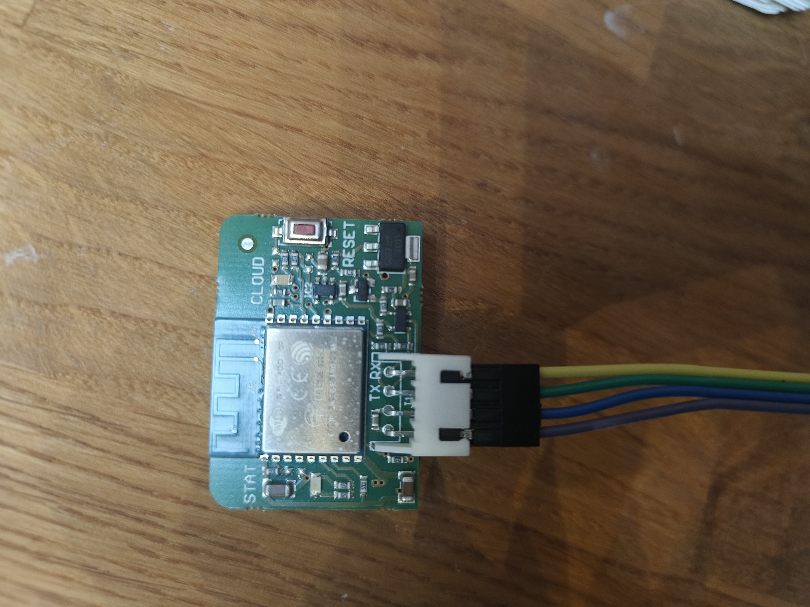
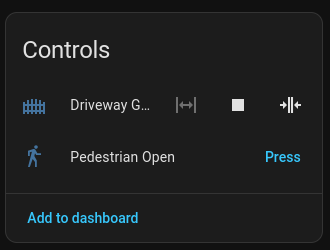
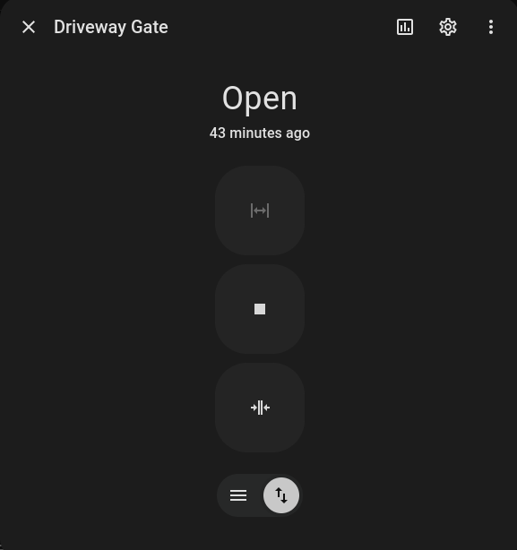

# ESPHome — Roger Technology Brushless Gate Motor

I recently got a new driveway gate installed and wanted to integrate it with Home Assistant. The user manual lists several screw terminal inputs which can be closed to activate various functions, and some limited status feedback is achievable by monitoring the state of the courtesy / activity light outputs. But, being me, I was intrigued by the WiFi header on the board. Being 4 pins, I was pretty sure that they would be power, ground and a pair of serial lines. I just *had* to buy a Roger B74/BConnect module to find out!

Well, the module arrived  and when I extracted the PCB from the case, my suspicions were confirmend .

The next step was to determine the voltages, baud rate and protocol of the serial comms. I used my logic analyser and https://sigrok.org/wiki/PulseView to confirm that the serial was 3V3 TTL and 1152008N1 baud. Also the communications was clearly Modbus RTU, which Pulseview could trivially decode :-)

# Protocol Analysis

To capture the serial traffic, I used ESPHome to create a node based on https://github.com/oxan/esphome-stream-server that exposes the serial port on the network. Then I connected the B74/BConnect to my laptop with a USB/Serial converter and used [this script](serial_dumps/serial_bridge.py) to record all of the serial traffic as the gate was commanded to open, close and move to the pedestrian position by the B74/BConnect.

Once all of those sequences were captured, I had a conversation with Claude.ai to analyse the traffic. It inferred the purpose of the various modbus holding registers that are polled and the commands to send. I then asked it to create an ESPHome component based on this knowledge. With a little bit of steering, it came up with [this](esphome/).

# Using this

Get an ESP8266 or ESP32 module. Connect the pins (2.5mm JST XH connector) on the Gate controller PCB to the relevant pins on the module.

Gate Controller pin 1 -> 5V
Gate Controller pin 2 -> GND
Gate Controller pin 3 -> TX
Gate Controller pin 4 -> RX

Import the included esphome component and config yaml into ESPhome and flash the module. Connect the discovered ESPHome device into home assistant, and now you should be able to control the gate using Home Assistant :-)

